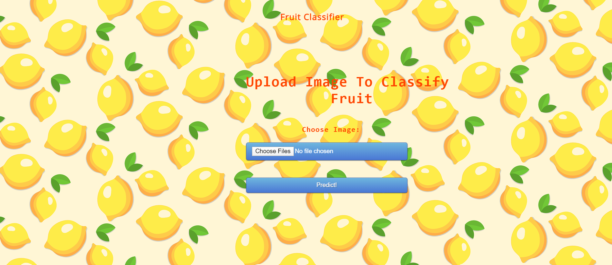
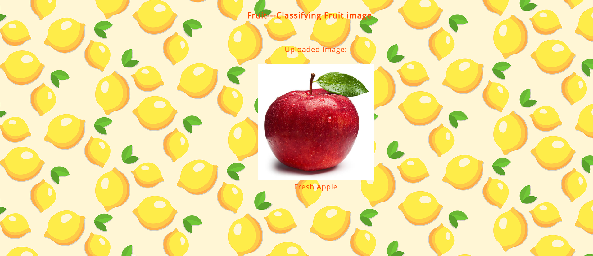
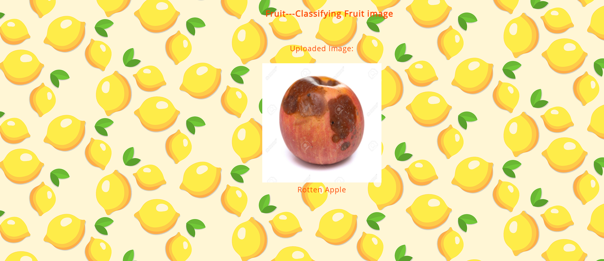
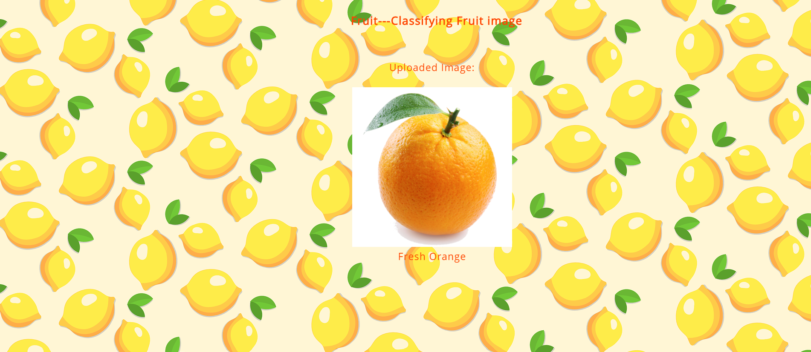
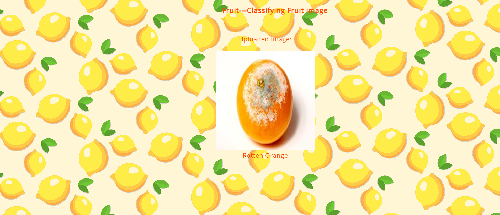
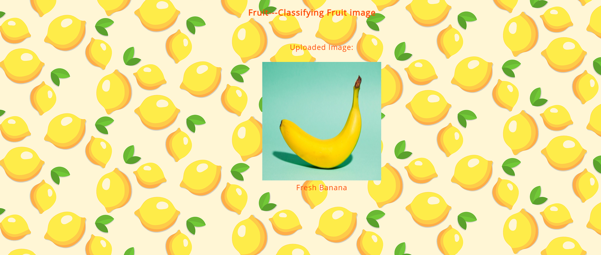
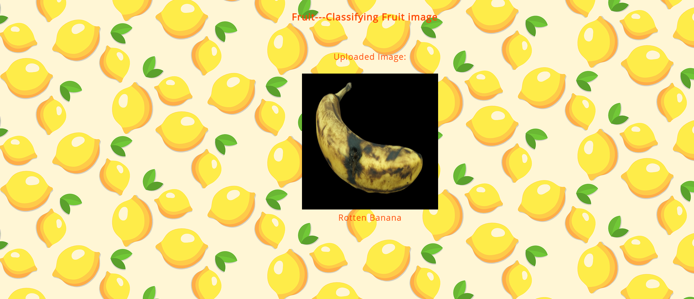

# Apple-Vs-Orange-Vs-Banana-Classifier
With the help of this code you can easily classify the following classes of fruits using few lines of code:
* Oranges
* Bananas
* Apples

And with all these it will also predict that the fruit is fresh or rotten.

## Here are some demos where you can see the output of code:

### 1) Home Page

### 2) Fresh Apple

### 3) Rotten Apple

### 4) Fresh Orange

### 5) Rotten Orange

### 6) Fresh Banana

### 7) Rotten Banana

